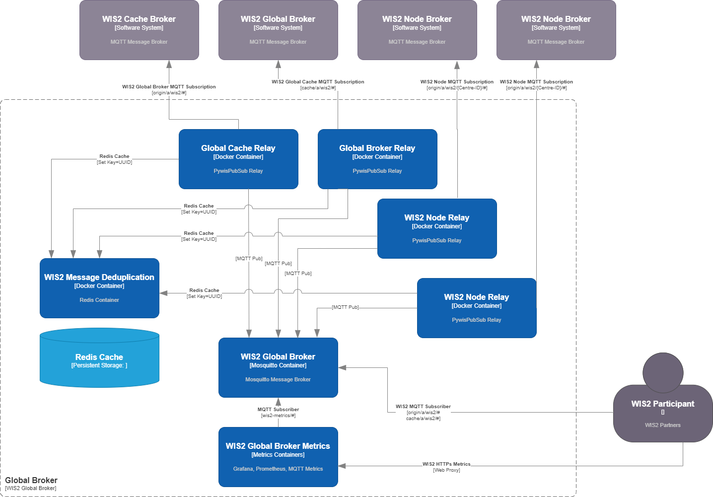

[](https://github.com/wmo-im/wis2-gb/actions)

# wis2-gb

wis2-gb is a Reference Implementation of a WIS2 Global Broker.

<a href="docs/GlobalBroker_C4.png"></a>

## Workflow

- connects to a WIS2 Global Broker, subscribed to the following:
  - `origin/a/wis2/#`
  - `cache/a/wis2/#`
- connects to a WIS2 Global Cache, subscribed to the following:
  - `cache/a/wis2/#`
- connects to one or more WIS2 Nodes, subscribing to the following:
  - `origin/a/wis2/{centre_id}/#`
- on all notifications:
  - verfies message is WIS2 compliant
  - verifies the message topic is WIS2 compliant
  - ensures the message is unique, not previously recieved from any other subscription
  - publishes the message to the Global Broker
  - performs metric accounting

## Installation

### Requirements
- Docker Compose

### Dependencies
Dependencies are listed in [REQUIREMENTS.md](REQUIREMENTS.md). Dependencies
are automatically installed during pywis-pubsub installation.

### Installing wis2-gb

```bash
# clone codebase and install
git clone https://github.com/wmo-im/wis2-gb.git
cd wis2-gb

# configure broker profile
./setup-links.sh brief
make build
make up
```

### Docker

The Docker setup uses Docker and Docker Compose to manage the following services:

- **wis2-broker**: MQTT broker
- **wis2-relay**: MQTT subscription relay.  Subscribes to WIS2 participants, performs message verification and de-duplication and then publishes the message to the Global Broker.
- **redis**: ['Redis Cache](https://redis.io/docs/latest/get-started/) provides hasing cache for de-duplication using Wis2 Notificaion Message UUID.
- **grafana**: [`Grafana`](https://grafana.com/grafana/dashboards/) provides administrator dashboards, log monitoring and browsing prometheus metrics.
- **loki**: [`Grafana Loki`](https://grafana.com/docs/loki/latest/) provides administrator dashboards, log monitoring and browsing prometheus metrics.
- **prometheus**:[`Prometheus`](https://prometheus.io/) provides time-series metrics collections

See [`wis2-gb.env`](wis2-gb.env) for default environment variable settings.

To adjust service ports, edit [`docker-compose.override.yml`](docker-compose.override.yml) accordingly.

The [`Makefile`](Makefile) in the root directory provides options to manage the Docker Compose setup.

```bash
# build all images
make build

# build all images (no cache)
make force-build

# start all containers
make up

# start all containers in dev mode
make dev

# view all container logs in realtime
make logs

# login to the wis2-gb-management container
make login

# restart all containers
make restart

# shutdown all containers
make down

# remove all volumes
make rm
```

## Development

### Code Conventions

* [PEP8](https://www.python.org/dev/peps/pep-0008)

### Bugs and Issues

All bugs, enhancements and issues are managed on [GitHub](https://github.com/wmo-im/wis2-gb/issues).

## Contact

* [Tom Kralidis](https://github.com/tomkralidis)
* [Marc Giannoni](https://github.com/mgiannoni)
